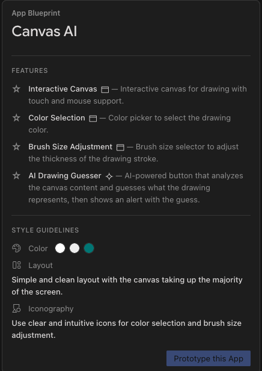

# Objective

To create an interactive drawing canvas app with a feature to guess the drawing
using AI.

# Input/Prompt

# Blueprint

# Output/Generated App

You can explore the code of the app generated in [app folder](./app). 

